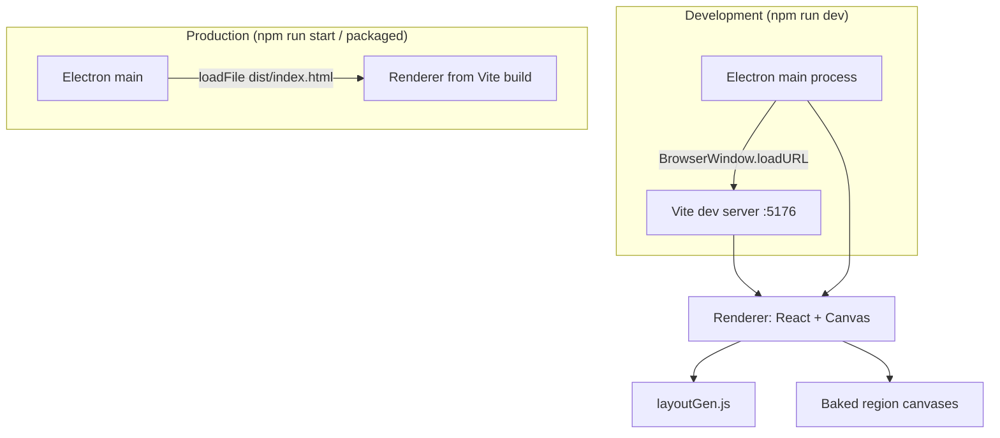
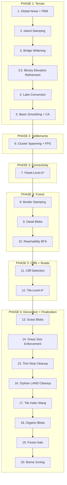

# Grasswhistle Architecture Overview

Grasswhistle is a high-performance desktop application for procedural map generation. It uses a decoupled architecture to separate generation logic from the rendering process.

---

## 🏛️ System High-Level Design

The app follows the standard **Electron** process model, separation of main (lifecycle) and renderer (UI) processes.

---

## 🗺️ The Generation Pipeline

The generation process is deterministic and follows a **20-step pipeline** (Steps **1–20** in `generateFromTerrain`) within `layoutGen.js`. Step numbers match **execution order** in source (biome zoning is **Step 20**, last). See **`ENGINE_PIPELINE.md`** for the full breakdown.

---

## 💾 Core Data Structures

### `region` Object
The central data structure returned by `generateRegion`.

| Field | Type | Description |
| :--- | :--- | :--- |
| **`panelData`** | `Object` | Map of `x,y` keys to panel grid objects. |
| **`width` / `height`** | `Number` | Dimensions in panel units (PANEL×PANEL). |
| **`roadPaths`** | `Array` | List of pixel-coordinate paths for all roads. |
| **`roadWaypoints`** | `Array` | Entry/exit pixel-coordinate waypoints used for road visualization debugging. |
| **`panelStats`** | `Object` | Map of `x,y` keys to per-panel statistics (land %, dominant elevation, uniformity). |
| **`assignedPanels`** | `Set` | Set of panel keys (`"x,y"`) that have a placed settlement. |
| **`terrain`** | `Array` | Stored terrain snapshot (`Uint8Array` of raw elevation values) for `regenerateFromTerrain`. |

### `panelData[key]` Object
Contains the pixel-level grid for a single chunk.

| Field | Type | Description |
| :--- | :--- | :--- |
| **`grid`** | `Array` | PANEL×PANEL cell objects (`{type, elevation, tileIndex}`). |
| **`biome`** | `Number` | Assigned biome index (0..5). |
| **`isRoute`** | `Boolean` | True if a road passes through this panel. |
| **`settlement`** | `Object` | Settlement descriptor if present (`{ kind: 'settlement', size: 'small'|'medium'|'large', id }`). |
| **`hasWater`** | `Boolean` | True if panel contains any ocean or lake. |
| **`isWaterDominant`** | `Boolean` | True if land covers < 50% of the panel. |
| **`isForestHalo`** | `Boolean` | True if panel was added by Step 19 as a render-only forest border. No gameplay logic. |
| **`secretHaloGroupId`** | `Number?` | Secret halo cluster id (enclosed halo group or pocket). Present only when secret halo is enabled. |
| **`secretHaloGroupSize`** | `Number?` | Size (panel count) of the secret halo cluster. |
| **`isSecretHaloPocket`** | `Boolean?` | True if this panel was an interior “pocket” enclosed by the halo ring (not part of the original halo growth). |
| **`isSecretHaloWaterAccess`** | `Boolean?` | True if the secret halo cluster borders a continuous water body that also borders the main (non-halo) visitable area. |
| **`isSecretHaloLandLocked`** | `Boolean?` | True if the secret halo cluster does not have water access to the main visitable area. |

### Cell Object (`grid[i]`)

| Field | Type | Description |
| :--- | :--- | :--- |
| **`type`** | `String` | Terrain type constant from `T` enum (e.g. `T.LAND`, `T.CLIFF`, `T.FOREST`). |
| **`elevation`** | `Number` | Integer level 0–6 (0 = water, 1 = lowest land, 6 = peak). |
| **`tileIndex`** | `Number` | Wang tile index (0–12 for land; 0–11 for cliff direction). Cliffs set in **Step 11**; Wang pass in **Step 17** (`calculateTileIndices`); recomputed after organic blobs and halo. |

---

## 🚀 Performance Strategy

1. **Canvas-Baking**: Maps are "baked" once to an offscreen canvas after generation. Panning and zooming utilize `drawImage`, ensuring 60FPS even on complex layouts.
2. **Two-Pass Rendering**: `bakeRegion()` / `renderRegion()` in **`render/regionRender.js`** — bake once per generation (pixel pass), composite every frame (`drawImage`).
3. **Determinism**: The `Mulberry32` PRNG ensures that identical seeds produce bit-identical results, simplifying bug reproduction. The **Golden Seed** (`12345`) is used for parity testing.
4. **Bit-Masking**: Structural boundary detection (Wang tile indexing, cliff detection) uses a `Uint8Array` bitmap with bitwise-style neighbor lookups for fast O(W×H) passes.
5. **Lazy-Deletion A\***: Both `panelRouteAStar` and `tileRoute` use lazy-deletion (`if (g > dist) continue`) instead of decrease-key, which is intentional and acceptable at current map scale (max 1024 nodes per tile search).

---

## 🗂️ Map Generator Tool (exported projects)

Separate from the live `layoutGen` pipeline: the **Map Generator** view in `App.jsx` loads a project folder produced by **Export** (metadata, `panels/{x}_{y}.json`, optional `imagery/*.png`, `mapping.json`, loose assets).

- **Cross-panel Wang / neighbors**: `loadMgNeighborPanelMap` (**`mg/mgCore.js`**) loads the eight adjacent `panels/*.json` when present; `recomputeMapGeneratorTileIndices` builds **(PANEL+2)²** extended bitmasks (1-cell world halo) so water, roads, and grass autotiles align at panel edges. The **stitched preview** and **downloads** use this path per panel. The sidebar **visitable panel picker** was removed — there is no longer a dedicated “pick one panel” flow in the UI; the **tile test** overlay (ASCII `generateTestPanel`) still uses panel-local indices when no world context is passed.
- **Stitched preview**: `buildMgMosaicCanvas` loads every visitable panel into a `panelMap`, recomputes each panel with the same world-aware step, then paints cells onto one world-sized **canvas** and draws forest tree sprites with deterministic placement. On-screen preview uses **1–8 px/cell** (max **16384** px per canvas side). **Download full** uses **32 px/cell** in a separate path (`mgExportFullMosaicChunked`): **8192×8192** max tiles, **`toBlob`** per tile, then **one ZIP** download (`jszip`) for multi-tile worlds or a single PNG if one chunk suffices.
- **Package for RMXP** (Electron): Writes **`MapNNN.rxdata`**, **`MapInfos.rxdata`**, **`Tilesets.rxdata`**, and **`Export/Graphics/Tilesets/tileset.png`**. App defaults in `App.jsx`: **`@tileset_id` / `Tilesets` slot 2** (`RMXP_TILESET_ID`); first panel map **Map003** (`RMXP_START_MAP_ID`), so **Map001**–**Map002** are not produced as panel exports. Details: **[Planning.md](Roadmap/Planning.md)** — **RPG Maker XP export**.
- **Pokémon Essentials PBS (Electron)**: Also writes **`Export/PBS/map_metadata.txt`** (with `ShowArea = true` for debugging) and map connection files:
  - `Export/PBS/map_connections.txt` — bordering edge connections (N/S/E/W format)
  - `Export/PBS/map_connections_extra.txt` — diagonal/corner-only coordinate connections (kept separate so Essentials Debug “Edit map_connections.txt” won’t erase them)

---

## 📦 Key Exports from `layoutGen.js`

| Export | Type | Description |
| :--- | :--- | :--- |
| `generateRegion` | Function | Main entry point. Runs the full `generateFromTerrain` pipeline with a retry loop. |
| `generateTestPanel` | Function | Generates a single isolated panel for tile testing. |
| `regenerateFromTerrain` | Function | Re-runs Steps 6–20 on a stored terrain snapshot. |
| `placeManualSettlement` | Function | Places a user-defined settlement cluster; call `regenerateFromTerrain` for a full pipeline refresh. |
| `dir12` | Function | Shared Wang 2-corner tile index function. `dir12(bmp, cx, cy, stride)` → 0–12. |
| `cliffTileIdx` | Function | Shared cliff direction encoder. `cliffTileIdx(N,S,E,W,NE,SE,SW,NW)` → 0–11. |
| `PANEL` | Constant | Panel dimension in cells (48). |
| `PALETTE` | Object | Master color palette for all terrain types. |
| `T` | Object | Terrain type enum (`T.OCEAN`, `T.LAND`, `T.LAKE`, `T.ROAD`, `T.FOREST`, `T.CLIFF`, `T.GRASS`, `T.WATERROAD`). |
