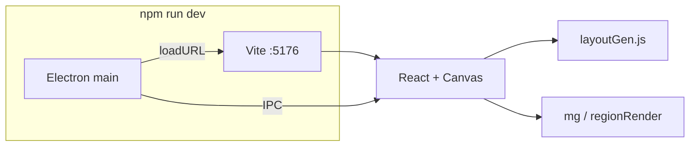

# Grasswhistle — Technical handbook

Single reference for architecture, pipelines, on-disk formats, and development. **License:** [MIT](../LICENSE). Third-party credits: [THIRD_PARTY_NOTICES.md](../THIRD_PARTY_NOTICES.md). Release history: [CHANGELOG.md](../CHANGELOG.md).

---

## Table of contents

1. [What this app is](#1-what-this-app-is)
2. [Quick start](#2-quick-start)
3. [Repository layout](#3-repository-layout)
4. [Processes & architecture](#4-processes--architecture)
5. [UI surfaces (`App.jsx`)](#5-ui-surfaces-appjsx)
6. [Procedural engine (`layoutGen.js`)](#6-procedural-engine-layoutgenjs)
7. [Layout rendering (`regionRender.js`)](#7-layout-rendering-regionrenderjs)
8. [Map Generator (`mg/`, `mgLayers.js`, `mgTilesetPack.js`)](#8-map-generator-mg-mglayersjs-mgtilesetpackjs)
9. [Wang grids & atlas packing](#9-wang-grids--atlas-packing)
10. [On-disk formats](#10-on-disk-formats)
11. [RMXP export & RX Converter](#11-rmxp-export--rx-converter)
12. [Main process & IPC](#12-main-process--ipc)
13. [Development workflow](#13-development-workflow)
14. [Extending the project](#14-extending-the-project)

**Appendix:** [wang_tile_layouts.md](./wang_tile_layouts.md) — full Wang / `cliff_double` tables, semantic master table, packing pointers.

---

## 1. What this app is

**Grasswhistle** is an **Electron + React** desktop app for **procedural world layout** (terrain, settlements, roads, forests, cliffs, biomes) and for **authoring RPG Maker XP–style map data** from exported projects (asset mapping, stitched preview, **`render.json`** + packed tilesets, optional **`.rxdata`** export).

- **Layout Generator** — runs the procedural pipeline, previews on canvas, exports a **Grasswhistle project folder** (`project.json`, `panels/*.json`, `world.png`, optional `mapping.json`).
- **Map Generator** — loads that export, maps terrain to PNG assets, shows a **world mosaic**, can save **`render.json`** + atlases and run **Package for RMXP** (Electron only).
- **Slicer** — placeholder screen (not implemented).

Core engine code is plain **JavaScript** (no TypeScript). Determinism uses a seeded **Mulberry32** PRNG where applicable.

---

## 2. Quick start

```bash
npm install
npm run dev          # Vite :5176 + Electron
npm run build        # renderer → dist/
npm run start        # Electron loads dist/ (production-style)
npm run pack:win     # optional: portable .exe under release/ (Windows x64)
npm run test         # Vitest (e.g. engine/tiling tests)
npm run lint         # ESLint: src/, main/, tools/**/*.mjs
```

There is **no** `test:golden` script in `package.json` by default; a golden-seed harness would live under `tools/regression/` if you add one.

---

## 3. Repository layout

| Path | Role |
| :--- | :--- |
| `electron-main.js` | Electron entry; creates window, registers IPC |
| `preload.js` | Exposes `window.electronAPI` |
| `main/` | Main process: IPC, project I/O, RMXP export orchestration |
| `src/renderer/main.jsx` | React entry |
| `src/renderer/App.jsx` | Start menu, Layout Generator, Map Generator, Slicer stub |
| `src/renderer/layoutGen.js` | Procedural generation (`generateRegion`, `generateFromTerrain`, steps 1–20) |
| `src/renderer/engine/` | `constants.js`, `tiling.js` (`dir12`, `cliffTileIdx`) |
| `src/renderer/render/regionRender.js` | `bakeRegion` / `renderRegion` for Layout preview |
| `src/renderer/mg/mgCore.js` | Mosaic build, `recomputeMapGeneratorTileIndices`, render bundle, export |
| `src/renderer/mgLayers.js` | Wang/cliff-double grids, drawing layers |
| `src/renderer/mgTilesetPack.js` | `packMgTileset`, RM tile IDs, atlas layout |
| `tools/RXConverter/` | Vendored **RX Converter**: Marshal, `.rxdata` writers, CLI scripts (see `tools/RXConverter/README.md`) |
| `assets/` | Bundled default terrain/tree/road/etc. art for Map Generator |
| `vite.config.js` | Dev server **port 5176** (see `wait-on` in `npm run dev`) |

---

## 4. Processes & architecture



- **Renderer** — React UI, all generation/packing logic that touches **canvas** and **layout** (runs in Chromium).
- **Main** — filesystem, dialogs, writing large payloads (`save-render-project`, RMXP copy/write). **RMXP `.rxdata` bytes** are produced by **importing** `tools/RXConverter/index.mjs` from `main/services/rmxpExport.js` (Node ESM).

---

## 5. UI surfaces (`App.jsx`)

| Screen | Purpose |
| :--- | :--- |
| **Start** | Choose Layout Generator, Map Generator, or Slicer |
| **Layout Generator** | Parameters → `generateRegion` → `bakeRegion` / `renderRegion`; **Export project** writes folder via IPC |
| **Map Generator** | **Load project** → mapping UI → stitched preview (`buildMgMosaicCanvas`), **Download PNG**, **save render bundle**, **Package for RMXP** (calls `mgBuildRenderProjectBundle`, then `saveRenderProject`, then `exportRmxpMaps`) |
| **Slicer** | Stub |

Layout tools: middle-mouse or right-drag pan, wheel zoom. **Zone edit** mode adjusts biome zones (pocket painting) where implemented.

---

## 6. Procedural engine (`layoutGen.js`)

**`generateRegion`** runs **`generateFromTerrain`** (with retries) and returns a **`region`** object: `panelData`, `width`/`height`, `roadPaths`, `terrain` snapshot, pocket/biome fields, etc.

**`generateFromTerrain`** executes **Steps 1–20** (comments in source use `// --- Step N ---`; **Step 20 = biome zoning**, last). High-level grouping:

| Range | Theme |
| :---: | :--- |
| 1–5 | Heightmap, islands (incl. 3.25 offshore), bridges, lakes, smoothing (5.1–5.3) |
| 6 | Settlements (sub-steps 6.0–6.6 incl. filler void pass) |
| 7 | Panel-level A\* “highways” + meander noise (sub-steps 7.5–7.6) |
| 8–10 | Forest borders, blobs, reachability |
| 11 | Cliff detection + `cliffTileIdx` direction encoding |
| 12 | Tile-level road stamping (sub-steps 12.4–12.6 incl. residual ocean cleanup) |
| 13–16 | Grass blobs, size enforcement, thin-strip cleanup, orphan land cleanup |
| 17 | Wang `tileIndex` for land/water/road/grass (`calculateTileIndices` / `dir12`) — cliffs keep Step 11 indices |
| 18 | Organic blobs — **disabled** (`ENABLE_ORGANIC_TERRAIN_BLOBS = false`) |
| 19 | Forest halo / secret halo |
| 20 | Biome zoning |

**Exports** (for other modules): `generateRegion`, `generateTestPanel`, `regenerateFromTerrain`, `placeManualSettlement`, `applyWaterBiomePass`, re-exports of `PANEL`, `T`, `PALETTE`, `dir12`, `cliffTileIdx`, etc. from `engine/constants.js` / `engine/tiling.js`.

**`cliffTileIdx(N,S,E,W,NE,SE,SW,NW)`** — single source for cliff direction → indices **0–11** (see Step 11 in source).

---

## 7. Layout rendering (`regionRender.js`)

- **`bakeRegion(region, exportMode, showPanelGrid, showBonusAreas)`** — expensive; builds offscreen canvases: base terrain, overlay (grid, cluster outlines), biome tint, road debug, cliff debug layers, etc.
- **`renderRegion(canvas, region, view, baked, …)`** — cheap; scales and composites baked layers with zoom/pan.

**Preview:** for `exportMode === false`, **non-visitable** panels (not route/settlement) are drawn **transparent** so the UI background shows; **export** uses `exportMode === true` for a full opaque **`world.png`**. Accent colors use **`mgCanvasColors()`** (CSS variables).

---

## 8. Map Generator (`mg/`, `mgLayers.js`, `mgTilesetPack.js`)

- **`mgPrepareMosaicData`** loads each visitable panel’s JSON via IPC into a **`panelMap`** (`"px,py"` → grid).
- **`recomputeMapGeneratorTileIndices(grid, { px, py, panelMap })`** builds **(PANEL+2)²** bitmasks with a **1-cell halo** so **`dir12`** matches across panel edges.
- **Stitched preview** — fixed **`MG_PREVIEW_CELL_PX`** (4px/cell); canvas size capped by **`MG_CANVAS_SAFE_MAX_DIM`** (16384px per side).
- **Full download** — **`mgExportFullMosaicChunked`**: **32px/cell**, chunks up to **`MG_EXPORT_CHUNK_PX`**, ZIP via **jszip**, **`toBlob`** (not `toDataURL`).

**`mgBuildRenderProjectBundle`** produces JSON + PNG base64 for IPC; main process writes **`render.json`**, **`Export/Graphics/Tilesets/tileset.png`**, optional **`tileset_bm_*.png`**, **`Export/biome_panel_counts.md`**.

---

## 9. Wang grids & atlas packing

**Full reference:** **[wang_tile_layouts.md](./wang_tile_layouts.md)** — 1×13 strip, **5×3** grid (all 15 cells), **5×4** `cliff_double`, master semantic→sheet table, **`MG_WANG_SEMANTIC_TO_GRID`**, export notes.

- **Land / road / water / grass** strips use a **5×3** export grid per strip in the atlas (`mgWangExportCellForPack`, **`MG_WANG_EXPORT_BLOCK_*`** in `mgLayers.js`). **Cliff** strips use indices **0–11** only (no index 12 in the pack).
- **Composite cliffs** and **forest `|f32|`** sidecars — packing rules in **`mgTilesetPack.js`** (forest 3×3 beside Wang rows, 256px-wide slots).
- **RM tile IDs** — `serializedConversionTableFromLookup`, static base **384** (`RM_STATIC_TILE_ID_BASE`).

---

## 10. On-disk formats

### Layout export (folder)

- **`project.json`** — metadata; **`seed`** = terrain seed from the winning generation when present  
- **`world.png`** — full stitched preview  
- **`panels/{x}_{y}.json`** — per-panel cells + flags  
- **`imagery/*.png`**, **`mapping.json`**, **`assets/**`** — optional  

### `mapping.json`

Slots: `ROAD`, `FOREST`, `FOREST_BODY`, `FOREST_TOP`, `GRASS`, `WATER`, `CLIFF`, `GROUND_BY_BIOME`, `TREE_BY_BIOME`, … — each slot **`assetId`** + **`isTileset`**; biome rows map biome index **0–5** to namespaced ids.

### `render.json` (Map Generator render bundle)

Grasswhistle always writes the same shape today. Top-level **`schemaVersion`** is **`3`** (opaque format id for external tools; you can ignore it unless you fork the writer).

- **`tileset`** — master atlas + **`conversionTable`**
- **`biomeTilesets[]`** — per–biome-composition atlases (`tileset_bm_*.png`) + per-atlas **`conversionTable`**
- **`exportGroups[]`** — which panels share each composition / **`biomeTilesetIndex`**
- **`panels[]`** — **`biomeComposition`**, **`biomeTilesetIndex`**, cells with **`rmTileId`**, derived **`layer1/2/3`**, optional **`forestRmStamp`**, cliff biome high/low where needed

See **`main/services/renderProject.js`** for write paths.

---

## 11. RMXP export & RX Converter

**Package for RMXP** (renderer) calls IPC after saving the render bundle.

**`main/services/rmxpExport.js`**:

1. Resolves **RX Converter root** via **`getRxConverterPaths(appRoot)`** (`main/services/paths.js`):  
   - Environment variable **`GRASSWHISTLE_RXCONVERTER`** (directory containing **`index.mjs`**), or  
   - **`{app root}/tools/RXConverter`**
2. **`import()`** `index.mjs` and runs **`exportRenderBundleToRmxpDataDir`**, tileset/MapInfos builders, etc.
3. Writes under chosen output dir: **`Export/Data/Map*.rxdata`**, **`MapInfos.rxdata`**, **`Tilesets.rxdata`**, **`Export/Graphics/Tilesets/`**, **`Export/PBS/*.txt`**, **`Export/README_EXPORT.txt`**, **`Export/EXPORT_REFERENCE.md`**.

**Dependency:** root **`package.json`** includes **`@hyrious/marshal`** for Node resolution when RX Converter modules import it.

**CLI / round-trips** — `tools/RXConverter/README.md` (e.g. `rxdata-to-json.mjs`, `json-to-rxdata.mjs`).

---

## 12. Main process & IPC

`preload.js` exposes **`window.electronAPI`**. Channels include:

| Channel | Purpose |
| :--- | :--- |
| `select-folder` | Directory picker |
| `export-project` | Layout export to disk |
| `load-project` | Load Grasswhistle project |
| `save-mapping` / `load-panel-data` | `mapping.json` + panel JSON |
| `save-render-project` | `render.json` + tileset PNG(s) + biome markdown |
| `export-rmxp-maps` | RMXP package (see §11) |
| `get-assets`, `get-assets-from-folder`, `get-default-assets`, `get-bundled-grasswhistle-assets` | Asset discovery |
| `get-default-*-biome-folder` | Default `assets/` subfolders |
| `get-test-panel` / `save-test-panel` | Dev test panel JSON |

Implementation: **`main/ipc/index.js`**.

---

## 13. Development workflow

- **Lint** — `eslint.config.js`: React rules for `src/**/*.{js,jsx}`, Node for `main/`, `electron-main.js`, `preload.js`, `tools/**/*.mjs`.
- **Tests** — `vitest`; engine tests live under `src/renderer/engine/*.test.js`.
- **Portable build** — `npm run pack:win` includes **`tools/RXConverter/**/*`** in the packaged app (see `package.json` → `build.files`).

---

## 14. Extending the project

**New biome (layout + UI + tints)**  

1. Add biome id in **`engine/constants.js`** (`BIOME`, `BIOME_NAMES`, `BIOME_PALETTES`).  
2. Update **`App.jsx`** biome key lists / labels for asset matching.  
3. **`regionRender.js`** — `BIOME_RGBA` for tint overlay.  
4. **`layoutGen.js`** Step 20 — zoning rules / seeds as needed.  
5. Provide assets under **`assets/`** biome folders for Map Generator.

**Palette / terrain colors** — **`PALETTE`** / **`BIOME_PALETTES`** in **`engine/constants.js`** (imported by `layoutGen.js` and render code).

**Panel route shape** — **`PANEL_ROUTE_MEANDER_WEIGHT`** / **`PANEL_ROUTE_MEANDER_SCALE`** near panel A\* in **`layoutGen.js`** (changing them reorders PRNG consumption for later steps).

**New pipeline step** — insert inside **`generateFromTerrain`** with clear **`// --- Step N ---`**; use the shared **`rand`** only (no `Math.random()`). Document dependencies (e.g. do not rely on Wang indices before Step 17).

---

*End of handbook.*
